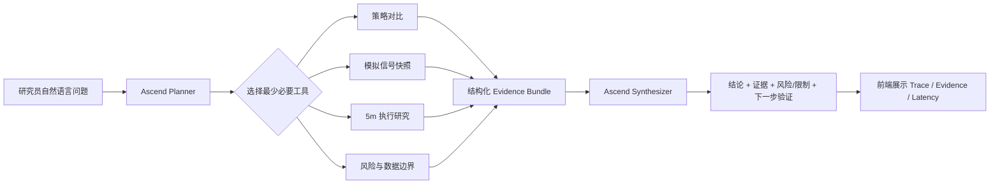

# ETF Research Copilot · 昇腾投研证据 Agent

> 金融行业应用 Agent 黑客松参赛版：把已有 ETF 量化研究资产从“静态看板”升级为“可提问、可追溯、可解释”的投研 Agent。

**赛道定位：智能投研助理 / 监管友好的研究证据 Agent**  
**推理底座：Ascend / AtomGit AI API**  
**默认模型：`deepseek-v4-flash`**  
**安全边界：research-only，不连接券商，不生成真实订单，不提供个性化买卖指令。**

> 🎬 Demo 录屏：**投稿前补充视频链接**（比赛要求视频链接放在 README）

---

## 1. 解决什么真实问题

量化研究人员经常面对一个低效流程：

1. 在多个表格 / 回测结果之间找指标；
2. 手动对齐不同时间窗口；
3. 比较收益、回撤、换手与持有期；
4. 再检查数据刷新状态和执行研究边界；
5. 最后把这些信息重新写成可解释的结论。

**ETF Research Copilot** 把这条链路压缩成一次自然语言查询，但不让大模型直接“凭感觉”回答：模型负责规划和解释，工具层负责取事实。

---

## 2. Agent 核心闭环



Agent 采用两阶段流程：

- **Planner**：先调用昇腾模型，根据问题选择最多 3 个工具；
- **Retrieve**：工具只读取仓库内 `public-safe` 研究 JSON；
- **Synthesizer**：再次调用昇腾模型，只基于结构化证据生成回答；
- **Trace**：返回选用工具、证据包、Planner / 模型延迟，方便审计与答辩展示。

如果 Planner 输出不是合法 JSON，系统会退回本地确定性路由，但最终回答仍必须经过配置的 Ascend / AtomGit 模型；**没有 Token 时不会伪造模型结果**。

---

## 3. 当前可调用工具

| Tool | 用途 | 关键输出 |
| --- | --- | --- |
| `project_overview` | 研究范围与数据状态 | 数据版本、日期范围、刷新状态、安全边界 |
| `strategy_comparison` | 同区间策略比较 | 总收益、最大回撤、胜率、换手率、平均持有期 |
| `signal_snapshot` | 读取模拟研究信号 | signal day、目标快照、刷新警告 |
| `execution_research` | 读取 5 分钟执行研究 | 固定时间策略、候选窗口、研究边界 |
| `risk_guardrails` | 风险与合规检查 | 回撤、换手、数据新鲜度、禁止事项 |

---

## 4. 已有研究证据

本仓库保留原 ETF Rotation Research Lab 的公开安全数据。当前 public snapshot：

- 生成时间：`2026-07-07`
- 同期研究区间：`2025-09-10` ~ `2026-05-18`
- folds：`161`

全样本历史结果（仅研究展示，不代表未来表现）：

| Strategy | Total return | Max drawdown | Win rate | Mean turnover |
| --- | ---: | ---: | ---: | ---: |
| Baseline 5D | +51.83% | -11.78% | 55.90% | 15.42% |
| Hold Bonus | +104.87% | -17.38% | 59.01% | 35.09% |
| Core2 / Satellite | +68.58% | -15.09% | 58.39% | 29.71% |

Agent 不会把“历史收益最高”改写成“未来最值得买”，而是同时返回回撤、换手、样本窗口与待验证项。

---

## 5. 昇腾 / AtomGit API 集成

AtomGit 官方 OpenAPI 文档提供文本生成接口：

```text
POST https://api.atomgit.com/api/v5/chat/completions
```

本项目默认使用：

```bash
ASCEND_BASE_URL=https://api.atomgit.com/api/v5
ASCEND_MODEL=deepseek-v4-flash
```

比赛期间也可替换成任何符合 `/chat/completions` 风格的昇腾推理服务地址。

### 环境变量

```bash
cp .env.example .env

export ASCEND_BASE_URL="https://api.atomgit.com/api/v5"
export ASCEND_API_KEY="YOUR_TOKEN"
export ASCEND_MODEL="deepseek-v4-flash"
```

**不要把 Token 提交到仓库。**

---

## 6. 一键运行

### 方式 A：本地 Python

```bash
python3 -m venv .venv
source .venv/bin/activate
pip install -r requirements.txt

export ASCEND_API_KEY="YOUR_TOKEN"
uvicorn server:app --host 0.0.0.0 --port 8000
```

打开：

```text
http://localhost:8000
```

原始研究 Dashboard 仍保留在：

```text
http://localhost:8000/index.html
```

### 方式 B：Docker

```bash
docker build -t etf-research-copilot .
docker run --rm -p 8000:8000 \
  -e ASCEND_API_KEY="YOUR_TOKEN" \
  -e ASCEND_MODEL="deepseek-v4-flash" \
  etf-research-copilot
```

---

## 7. Demo 建议问题

录屏时按下面顺序演示，约 60~90 秒即可覆盖核心能力：

```text
1. 比较全样本三个策略的收益、最大回撤和换手率，哪个历史表现更强？
2. 当前研究信号快照是什么？数据是否有刷新警告？
3. 5分钟执行研究目前支持什么结论，哪些结论还不能下？
4. 从风险角度比较三个策略，并指出数据边界。
```

前端会同步展示：

- Planner 选用了哪些工具；
- Retrieve 得到多少证据包；
- 使用的 Ascend 模型；
- 总响应时延；
- 可展开查看的原始结构化证据。

---

## 8. API

### Health

```bash
curl http://localhost:8000/api/health
```

重点检查：

```json
{
  "ascend_configured": true,
  "model": "deepseek-v4-flash",
  "broker_connected": false
}
```

### Agent Query

```bash
curl -X POST http://localhost:8000/api/agent/query \
  -H 'Content-Type: application/json' \
  -d '{"question":"比较120天窗口三个策略的收益和回撤"}'
```

### Tool Benchmark

```bash
curl "http://localhost:8000/api/benchmark?runs=100"
```

该接口只测本地 Evidence Tool 延迟；真实模型延迟会在每次 `/api/agent/query` 返回的 `latency_ms` 中记录。**README 不预填未经实测的性能数字，录屏前请用实际环境跑一次并截图。**

---

## 9. 技术栈与目录

```text
.
├── competition.html       # 黑客松主界面
├── competition.css        # 主界面视觉系统
├── agent.js               # Agent 前端交互 / Trace / Evidence 展示
├── agent.css              # Agent workspace 样式
├── server.py              # FastAPI 服务、health、query、benchmark
├── agent_core.py          # Planner / Tools / Synthesizer / Ascend Adapter
├── requirements.txt
├── Dockerfile
├── .env.example
├── index.html             # 原始 ETF 研究 Dashboard
├── app.js
├── styles.css
└── data/
    └── strategy_dashboard_data.json
```

后端仅依赖 FastAPI + Python 标准库 HTTP client，避免为黑客松引入过重 Agent 框架，提高可运行性与可解释性。

---

## 10. 技术创新点

1. **Evidence-first Agent**：模型不直接读取整份数据后自由发挥，而是先选工具再取结构化证据。
2. **两阶段 Ascend 推理**：Planner 与 Synthesizer 都经过昇腾模型，形成真实 Agent 闭环。
3. **可审计回答**：前端可展开最近一次 Evidence Bundle，数值来源可复核。
4. **金融安全边界内建**：无 broker tool、无下单接口、无账户数据，并主动区分历史研究与未来判断。
5. **保留原研究系统**：不是为比赛另做一个 mockup，而是在已有 ETF 量化研究与执行研究资产上增加 Agent 层。

---

## 11. 落地场景与商业化

### 目标客户

- 券商 / 基金量化研究团队
- 财富管理机构研究岗
- 银行理财研究与产品团队
- 需要“数据结论可追溯”的内部投研平台

### 落地价值

把研究员高频的“找指标 → 对齐窗口 → 查风险 → 写结论”流程转成可复用 Agent 工作流。企业版本可继续接入内部研究库、研报、因子平台和权限系统，但交易执行仍应保持独立审批与风控边界。

### 商业模式

- 私有化部署 / 年度订阅
- 按研究席位授权
- 企业数据源与内部知识库集成服务

---

## 12. 投稿前 Checklist

- [ ] 在 AtomGit 创建 / 镜像比赛仓库
- [ ] 配置比赛发放的 Ascend / AtomGit Token
- [ ] `GET /api/health` 确认 `ascend_configured=true`
- [ ] 跑 4 个 Demo 问题，确认 Trace 和 Evidence 正常
- [ ] `GET /api/benchmark?runs=100` 截图真实性能数据
- [ ] 录制 60~90 秒产品演示视频
- [ ] 把视频链接补到 README 顶部
- [ ] README 放架构图、核心模块截图、真实性能数据
- [ ] 在比赛页面提交 AtomGit 仓库地址

---

## Safety / Boundary

This repository is a **research-only** system. It does not connect to a broker, does not read account credentials, and does not place or simulate real customer orders. Historical backtest results are not investment advice and are not promises of future performance.
